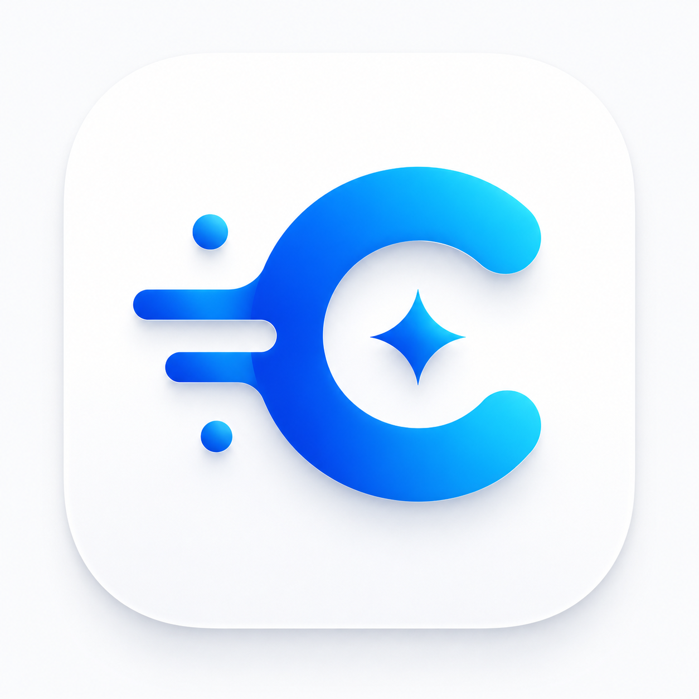

# ColdRunners — Autonomous Business Intelligence Platform

<div align="center">

</div>

Local-first agentic AI platform that autonomously discovers, analyzes, scores, and exports qualified business leads. Built with TypeScript, Express, React, and MCP.

## Quick Start

```bash
npm install
cp .env.example .env
npm run dev
```

Open `http://localhost:3000`

## Features

- **Autonomous Agent Workflow** — 6 specialized agents orchestrated by Master Planner
- **MCP Server** — 9 tools + 6 resources for AI agent integration
- **Compliant APIs** — Google Places, Firecrawl, Hunter.io, Apollo.io, PageSpeed
- **Opportunity Scoring** — 0-100 algorithm with HOT/WARM/COLD classification
- **Multi-format Export** — CSV, JSON, Excel, Markdown
- **Real-time Dashboard** — Lead explorer, campaign builder, reports, terminal logs
- **Graceful Degradation** — Works without API keys using simulated fallback data

## Architecture

```
React Frontend (Vite + Tailwind)
         │
    Express Server
         │
    ┌────┼────────────────┐
    │    │                │
  Agents Plugins       MCP Server
    │    │                │
    └────┼────────────────┘
         │
   Workflow Engine
         │
    In-Memory DB
```

## Documentation

See [docs/](docs/) for the complete engineering handbook.

| Document | Description |
|----------|-------------|
| [PLAN.md](PLAN.md) | Product vision, phases, milestones |
| [ARCHITECTURE.md](ARCHITECTURE.md) | System architecture overview |
| [AGENTS.md](AGENTS.md) | Agent orchestration rules |
| [CLAUDE.md](CLAUDE.md) | AI coding guide |
| [docs/architecture.md](docs/architecture.md) | Detailed system architecture |
| [docs/backend.md](docs/backend.md) | Backend standards |
| [docs/frontend.md](docs/frontend.md) | Frontend architecture |
| [docs/api.md](docs/api.md) | API reference |
| [docs/mcp.md](docs/mcp.md) | MCP integration guide |
| [docs/agents.md](docs/agents.md) | Agent system deep dive |
| [docs/localmodels.md](docs/localmodels.md) | Local AI model handbook |
| [docs/crawler.md](docs/crawler.md) | Crawler architecture |
| [docs/roadmap.md](docs/roadmap.md) | Product roadmap |

## Tech Stack

- **Backend:** Express 4, TypeScript 5.8, Vite 6
- **Frontend:** React 19, Tailwind CSS 4, Recharts, Motion, Lucide
- **AI:** Google Gemini API (Ollama planned)
- **Protocol:** MCP (Model Context Protocol)
- **APIs:** Google Places, Firecrawl, Hunter.io, Apollo.io, PageSpeed Insights

## Scripts

```bash
npm run dev        # Development server
npm run build      # Production build
npm run start      # Run production server
npm run lint       # TypeScript type check
npm run clean      # Clean build artifacts
```

## License

Proprietary — ColdRunners
# coldrunner
